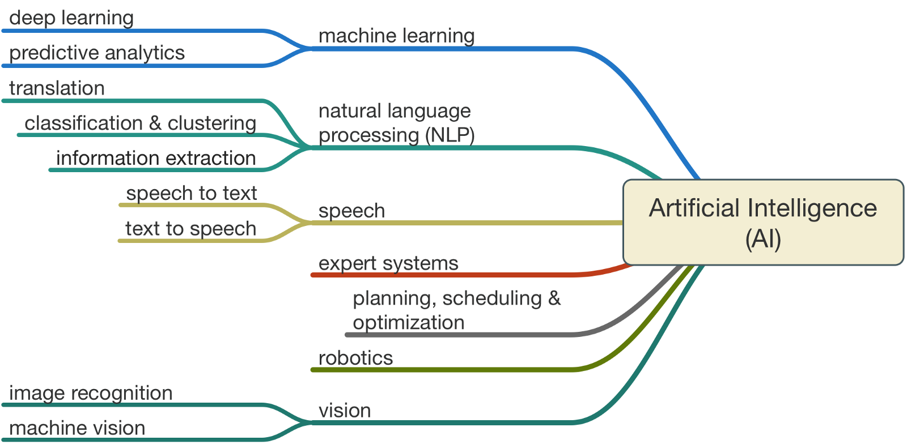

# Introduction

## Branches of AI

### Heuristics

### Fuzzy Logic

### Expert Systems

### Search Optimisation

### Deep Learning

### Hybrid Intelligence

### Machine Learning

### Natural Language Processing

### Computer Vision

### Genetic Programming

### Cognitive Computing

### Nature-inspired Intelligent Computation

To tackle complex real world problems, scientists have been looking into natural processes and creatures - both as model and metaphor - for years. Optimisation is at the heart of many natural processes including Darwinian evolution, social group behaviour and foraging strategies. Over the last few decades, there has been remarkable growth in the field of nature-inspired search and optimisation algorithms. Currently these techniques are applied to a variety of problems, ranging from scientific research to industry and commerce. The two main families of algorithms that primarily constitute this field today are the evolutionary computing methods and the swarm intelligence algorithms. Although both families of algorithms are generally dedicated towards solving search and optimisation problems, they are certainly not equivalent, and each has its own distinguishing features. Reinforcing each other's performance makes powerful hybrid algorithms capable of solving many intractable search and optimisation problems.

General areas of nature inspired intelligence includes Genetic Algorithms, and Genetic Programming, Evolution Strategies, and Evolutionary Programming, Differential Evolution, Artificial Immune Systems, Particle Swarms, Ant Colony, Bacterial Foraging, Artificial Bees, Fireflies Algorithm, Harmony Search, Artificial Life, Digital Organisms, Estimation of Distribution Algorithms, Stochastic Diffusion Search, Quantum Computing, Nano Computing, Membrane Computing, Human-centric Computing, Hybridization of Algorithms, Memetic Computing, Autonomic Computing, Self-organizing systems, Combinatorial, Discrete, Binary, Constrained, Multi-objective, Multi-modal, Dynamic, and Large-scale Optimization
